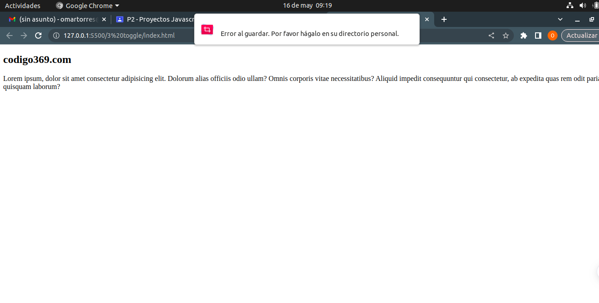
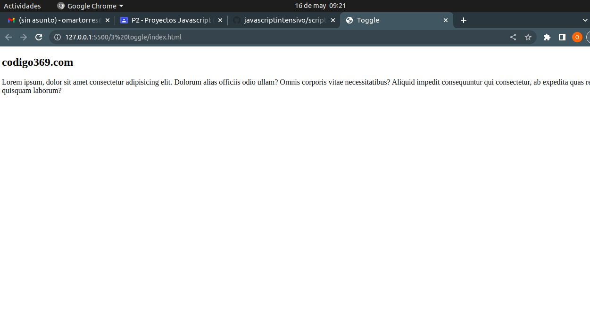
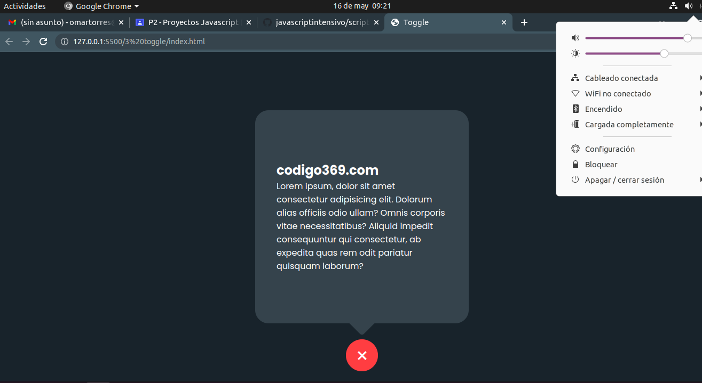

# Proyectos-Javascript--Videotutorial-
Se desarrollaran uno a uno los vídeos propuestos en clase

# Ejercicio 1
### Este sitio web se basa en una calculadora personalizada en la cual nos enseña como hacer que su color cambie y al mismo tiempo personalizarlo 

# Index.html 
### Aqui se crea el cuerpo de lo que seria la calculadora con sus diferentes bloques de separacion de esta misma utilizando la funcion "div", sin ningun tipo de decoración y con sus funcionamientos totales como /, *, borrar, etc. Con ayuda del apartado script.js se consigue poder agregar la pantalla para poder agregar los procedimientos que querramos 

# Script.js
### Esto nos permite agregar la mini pantalla que mencione anteriormente para los procedimientos con ayuda de diferentes ayudas como los parametros y caracteres, tambien esta una opcion llamada eval que lo que hace es tomar las cosas como una operacion aritmetica como otras funcines como esperar un tiempo determinado para que desaparezca lo escrito 

# Styles(css,map,scss)

### Este apartado nos enseña a empezar a acomodar las diferetes clases de objetos con ayuda de class para poder darle una mejor visualización como añadiendo objetos, centrando los objetos, agregando colores de lacalculadora, colores de fondo, dandole un tamaño a cada boton y su respectivo borde, opcion de cambio de color y nos permite con ayuda de scipt.js hacer todas estas funciones y obtener un gran resultado 

# Ejercicio 2
### Nos muestra un menu desplegable altamente decorado con ayuda de sus diferentes funciónes de programación tales como Javascript, css, etc

# styles(css,css.map,scss)
## css

### El menú tiene un botón de alternancia que se puede utilizar para abrir y cerrar el menú. Cuando se hace clic en el botón, los elementos del menú aparecen en la pantalla. Los elementos del menú se muestran verticalmente y están ocultos inicialmente.

### El elemento activo del menú se destaca con un color diferente al resto. Al hacer clic en un elemento del menú, el usuario será llevado a la página correspondiente.

### En resumen, este código CSS es utilizado para crear un menú de navegación fijo, que tiene una apariencia atractiva y es fácil de usar.

## Css.map
### Este es un mapeo de caracteres que se utiliza para relacionar el código generado con el código fuente original. Se utiliza para depurar el código y encontrar errores más rápido. Es una herramienta útil para los desarrolladores.

## Scss
### Este es un código CSS que sirve para crear un menú de navegación. El menú tiene una posición fija y un fondo blanco con bordes redondeados. Cuando el menú se abre, se expande y muestra los ítems de la lista que contienen un icono y texto. El texto está oculto inicialmente y aparece cuando el menú se abre. El código utiliza la fuente Poppins de Google Fonts.

### Asi se ve terminado 

# EJERCICIO 3 (Toggle)
### se basa en un mecanismo el cual al darle clic abre la ventana donde esta un texto con informacion el cual hace una transicion.

# index

### La etiqueta DOCTYPE html indica que el documento es un archivo HTML. Las etiquetas html, head, meta, title, link y body son algunas de las etiquetas que se utilizan para estructurar la página web y agregar información adicional, como el título y los estilos. La etiqueta body es donde se coloca todo el contenido visible de la página web.

# script js

### cuando se hace clic en el botón con la clase .toggleBtn, se agrega o se quita la clase .active del elemento HTML con la clase .container. Esto permite mostrar u ocultar el contenido dentro del contenedor.

# css

### Este es un código que se utiliza para dar estilo a una página web. Se utilizan diferentes selectores para aplicar estilos a elementos específicos de la página, como el cuerpo de la página, un contenedor y sus elementos internos. Los estilos incluyen propiedades como el color de fondo, la altura y el ancho, la posición, el tamaño de fuente, la opacidad y las transformaciones.

# Ejercicio 4 
# Index
### Este código es para una página web en español. Contiene etiquetas HTML que definen la estructura de la página, así como información importante como la hoja de estilos, el título de la página y la codificación utilizada. También hay un botón con un ícono que se puede hacer clic para activar una función y un archivo JavaScript vinculado a la página, que le permite activar el modo oscuro

# Style(css,css.map,scss)
## Los códigos anteriores son para una página web que tiene un botón que cambia de color y forma cuando se hace clic en él. Aquí te explico cómo funciona cada uno de los códigos:

## HTML:

### El código HTML define la estructura de la página y contiene etiquetas que definen el título, la hoja de estilos y el botón. La función del botón es activar una clase "active" en el cuerpo de la página y en el botón mismo.
## CSS:

### El código CSS define el estilo visual de la página, incluyendo el diseño del botón y el fondo de la página.La función del CSS es hacer que el botón cambie de color y forma cuando se activa la clase "active" en el cuerpo de la página y en el botón mismo.
## JavaScript:

### El código JavaScript define la funcionalidad del botón, permitiendo que se active la clase "active" en el cuerpo de la página y en el botón mismo cuando se hace clic en él. En resumen, estos códigos trabajan juntos para crear un botón interactivo que cambia de color y forma cuando se hace clic en él, y también cambia el fondo de la página.

# Ejercicio 5
### Describe cómo se utiliza código CSS para hacer que una página web se vea bien y tenga una buena disposición de los elementos. Se utilizan diferentes estilos y colores para hacer que la página se vea atractiva. También se usan consultas de medios para que la página se adapte a diferentes tamaños de pantalla. En el archivo styles.scss, se encuentran diferentes clases y selectores que se usan para estilizar diferentes partes de la página.

